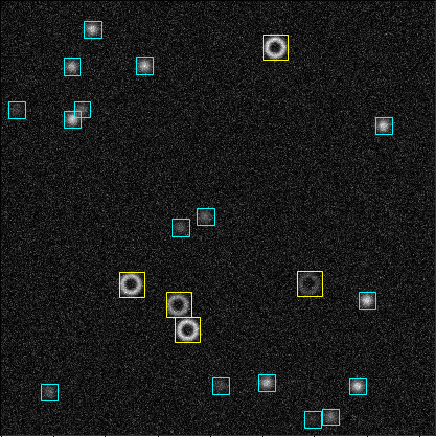
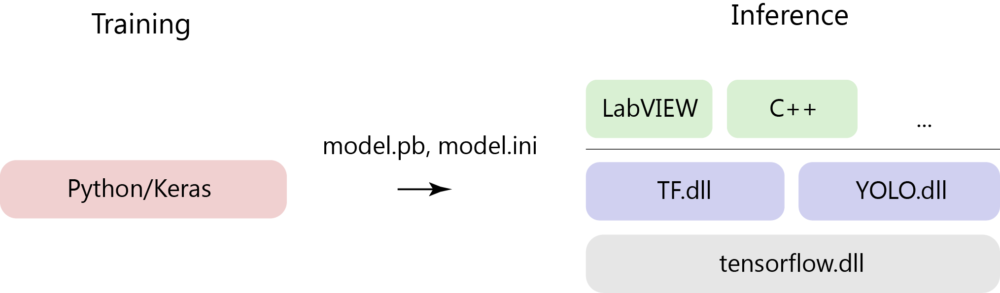

# YOLOv2 Framework for Digital Microscopy

*M. Fränzl\**

Molecular Nanophotonics Group, Peter Debye Institute for Soft Matter Physics, Universitäat Leipzig, Linnestr. 5, 04103 Leipzig, Germany
* [mailto](mailto:martin.fraenzl@physik.uni-leipzig.de)

## Content

- [Discription](#discription)
- [Repository Contents](#repository-contents)
- [Users Guide](#users-guide)
- [System Requirements](#system-requirements)
- [Setup Instructions](#setup-instructions)
- [License](./LICENSE)

## Discription 

This is a framework for the real-time localization and classification of objects in optical microscopy images using a single-shot covolutional neural network YOLO ("You Only Look Once") . We adapted the YOLOv2 architecture enabling to localize and classify objects at very low signal-to-noise ratios for images as large as 416 x 416 px at frame rates of up to 100 fps. Here, we provide scripts to train the network in Python/Keras using the TensorFlow backend and source codes to run the model inference on a GPU with C++ or LabVIEW.

     
  <b>Fig. 1</b> YOLOv2 detection for a darkfield microscopy image of nano- and microparticles.

## Repository Contents

- [YOLOv2 Training (Python)](./YOLOv2%20Training%20(Python)):  Jupyter notebooks and Python modules for synthetic image generation, training and exporting YOLOv2 models with Python/Keras using the TensorFlow backend
- [TF DLL](./TF%20DLL): DLL for running TensorFlow models on GPU (`TF.dll`)
- [YOLOv2 DLL](./YOLOv2%20DLL): DLL for decoding the YOLOv2 output tensor (`YOLOv2.dll`)
- [YOLOv2 Inference (LabVIEW)](./YOLOv2%20Inference%20(LabVIEW)): Example for importing and running a trained YOLOv2 model in LabVIEW
- [YOLOv2 Inference (C++)](./YOLOv2%20Inference%20(C%2B%2B)): Example for importing and running a trained model with Qt/C++

## Users Guide

The network is trained and evaluated in Python/Keras using the TensorFlow backend. For real-time inferencethe model graph is exported as protocol buffer file (`*.pb`) and parameters required to decode the YOLOv2 output are exported to an INI file (`*.ini`). These files are imported by the C based dynamic link libraries `TF.dll`, `YOLOv2.dll` that are easily integrable in other programming languages such as LabVIEW and C++. Fig. 1 shows the structure of the framework.

     
  <b>Fig. 2</b> Design of the framework used for training and real-time inference.

The `TF.dll` is a generic library for the inference of TensorFlow models build on top of the GPU supported [TensorFlow C API](https://www.tensorflow.org/install/lang_c) (`tensorflow.dll`). It can be used with any TensorFlow model and is not specific to YOLOv2. It is a copy of [TF-Framework/TF DLL](https://github.com/Molecular-Nanophotonics/TF-Framework). The `YOLOv2.dll` adds specific functions required to decode the YOLOv2 output and does not depend on the [TensorFlow C API](https://www.tensorflow.org/install/lang_c).

## System Requirements

 The framework requires Windows 7, 10 (64-Bit) and a GPU that supports CUDA Toolkit 10.0. It has been tested on the following system:
 - Windows 7, 64-Bit
 - Intel Core i7-2600 4 × 3.40 GHz CPU
 - GeForce GTX 1660 Ti GPU
 - CUDA Toolkit 10.0 + cuDNN 7.6.4
 - TensorFlow 1.13.1 GPU

## Setup Instructions

For setup instructions refer to the `README.md` in each directory. 
