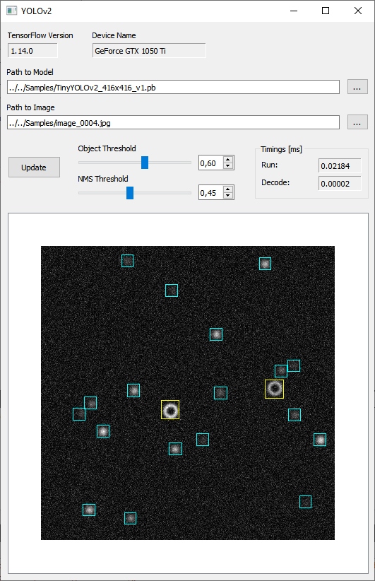

# YOLOv2 Inference (C++)

*M. Fränzl*, Molecular Nanophtonics Group

## Discription

Example on how to use `TF.dll` and `YOLOv2.dll` in a Qt/C++ application.

     
  <b>Fig. 1</b> Screenshot of the Qt/C++ application.

## Requirements 

- [Qt Creator](https://www.qt.io/download-qt-installer)
- [CUDA Toolkit 10.0](https://developer.nvidia.com/cuda-10.0-download-archive)
- [cdDNN 7.6.4](https://developer.nvidia.com/rdp/cudnn-archive)
- `tensorflow.dll` from [libtensorflow-gpu-windows-x86_64-1.13.1](https://storage.googleapis.com/tensorflow/libtensorflow/libtensorflow-gpu-windows-x86_64-1.13.1.zip)

